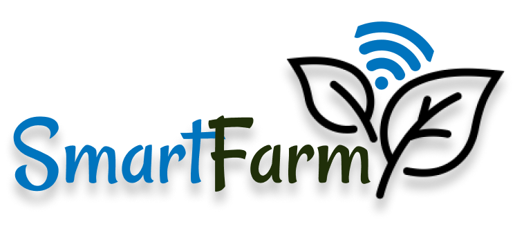

# SmartFarm Application

An application dedicated to control Smart Growth Chamber, by using Flutter.

> All codes can be accessed through `lib` folder.

## How to Run and Code?
It is preferable to use Visual Studio Code. These are the steps to run Flutter app on VS Code.
1. Install Flutter Extension. [Check here for more details!](https://docs.flutter.dev/tools/vs-code)
2. Install Gradle to create Android Apps. [Check here for more details!](https://gradle.org/install/)
3. To develop iOS apps, you need to install Xcode. [Check here for more details!](https://docs.flutter.dev/get-started/install/macos/mobile-ios)
3. Clone this repository and open in VS Code.
4. If you need to add more libraries to use, don't forget to add and specify dependencies (libraries) on `pubspec.yaml`.
5. If you need to add images, also don't forget to add and specify the assets on `pubspec.yaml` before including the images in your code.
6. Click `F5` on VS Code to build and run the app (not sure about using other IDEs).

## Main Features
- All menus are integrated through `main.dart`.
- This app consists of Home (`home.dart`), Graph (`graph.dart`), Setpoint (`setpoint.dart`), Camera (`camera.dart`), and Spectrum (`spectrum.dart`).
- Home Menu is used to show Camera Preview, current Sensor Data and current Setpoint.
- Graph Menu is used to show Temperature, Humidity, CO<sub>2</sub> Level, and Average Light Intensity Graphs. **Note that the graphs can be dragged horizontally**.
- Setpoint Menu is used to control Temperature, Humidity, CO<sub>2</sub>, and Light Setpoint values.
- Camera Menu is used to show Top, Bottom, and User Camera. Note that all images are available on `assets` folder.
- Spectrum (Spectrometer) Menu is used to show Expected Spectrum Graph, Spectrometer Image, and Obtained Spectrum Graph. **Note that the graphs can be dragged horizontally**.
- To change Graph, Setpoint, and Spectrum values, you can access `/lib/variables.dart`.

#### Expected Improvements
- The Sensor Values on Home Menu (`home.dart`) is hard-coded. You should connect it to real sensor values.
- The setpoint shown on Home Menu (`home.dart`) is hard-coded. Day setpoints will be shown during 05.00-18.00 and night setpoints will be shown after the time. You should connect it to day-night time which the user has specified.
- Currently, all data on Home (`home.dart`), Graph (`graph.dart`), Setpoint (`setpoint.dart`), Camera (`camera.dart`), and Spectrum (`spectrum.dart`) are specified in `variables.dart`. Change it to real values from database.

## Settings Features
- There are 4 (four) settings, namely Edit Profile (`editprofile.dart`), Change Password (`change_pwd.dart`), Night-Day Hour Settings (`nightday.dart`), and Device Settings (`dev_settings.dart`).
- Log Out feature has also been implemented.
- On Device Settings, the program can detect devices that have been approved. Approved devices are available on the "Change Device" menu, and those which haven't been approved are available on "Request Device Access" menu. You can simply add / remove List contents of `approvedDevices` and `requestedDevices` on `dev_settings.dart`.

#### Expected Improvements
- You should change the name (default: `Kadhan Dalilurahman` and institution (default: `ITB`) of the user, preferably on Change Password Menu (`change_pwd.dart`) and Device Settings (`dev_settings.dart`) by connecting to user data in database.
- Delete print on Night-Day Hour Settings, because it is used for debugging purposes only.
- Connect API to Edit Profile, Change Password, Night-Day Hour Settings, and Device Settings.
- On Device Settings, make sure that approved devices **would not appear** on "Request Device Access" anymore and vice-versa.

## Notification Features
- Notifications are handled by `notifications_loader.dart` to read JSON file and `notifications.dart` for the visual appearance.
- You can clear each notification by swiping each notification cards.
- Clear All notification is available through the button.
- Notifications are sorted from the newest to last. Also, they are grouped by days.
- If you want to try adding / removing notifications, please see `assets/json/notifications.json`.

This is the example `notifications.json`:
```json
{
"dateTime": "2025-01-24T14:30:00",
"header": "Your Program is Done",
"info": "The scheduled program has completed successfully."
},
```
**Note:** all components `dateTime`, `header`, and `info` **should be filled**. Failure to do so causes the `notification.dart` to return Error and hence Notification Menu **will not load**.

#### Expected Improvements
- Connect API to the Notifications Menu.

## Login / Register Screen
- Login is handled by `login.dart`. Register is handled by `register.dart`.
- For the initial implementation, the login logic is hard coded such that the fake credential is used.
- Users can use "Remember Me" checkbox to allow accessing the app without needing to login at a later time.

```
Current default credentials:
Username: testuser
Password: password123
```

#### Expected Improvements
- Connect API to the Login / Register Menus.

## Important Issues!
- There is a **loophole** on the app. This happens when the user has no access to any devices / have not set their selected devices. This is hard to implement because there is no logic to determine user's approved and selected devices (as the app is not connected to the database). Hence, after login, the user (who may not have access) will go straight to Home Menu (`home.dart`).
- **Please add a "no device" menu** later after API is connected, to prevent users (who do not have access to all devices / haven't set a device) to go straight to Home Menu (`home.dart`).
- It is noticed that values in the app **wouldn't update even if we change the variable values directly**. Please implement "Refresh" feature later (similar to when we refresh Instagram, by swiping down).
- You tell me if you notice more bugs.

## Flutter Tips

This project is a starting point for a Flutter application.

A few resources to get you started if this is your first Flutter project:

- [Lab: Write your first Flutter app](https://docs.flutter.dev/get-started/codelab)
- [Cookbook: Useful Flutter samples](https://docs.flutter.dev/cookbook)

For help getting started with Flutter development, view the
[online documentation](https://docs.flutter.dev/), which offers tutorials,
samples, guidance on mobile development, and a full API reference.